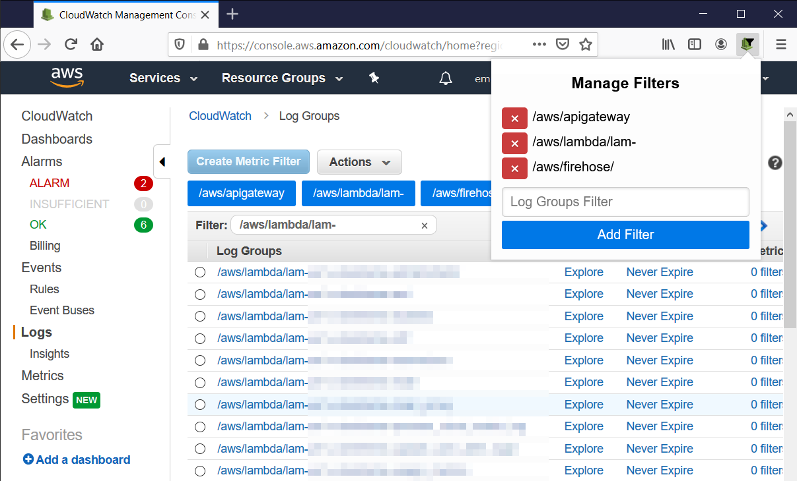

# CloudWatch Log Groups Filters

Web extension for creating custom CloudWatch Log Groups filters.

Click the extension icon to add or remove log groups filters.
Once added, filters will appear as buttons on the CloudWatch Log Groups page.
Filtering is done by matching the prefix of log groups names (it works the same as the *Filter* text input on the CloudWatch page).

Supported browsers: Mozilla Firefox, Google Chrome.

## Third Party Resources

The extension uses [Pure.CSS](https://purecss.io/) [v1.0.1](https://unpkg.com/purecss@1.0.1/build/pure-min.css) for styling.

Chrome is supported via [webextension-polyfill](https://github.com/mozilla/webextension-polyfill) [v.0.5.0](https://unpkg.com/webextension-polyfill@0.5.0/dist/browser-polyfill.min.js).

Extension icon was created using the following images: [iconify.design/icon-sets/logos/aws-cloudwatch.html](https://iconify.design/icon-sets/logos/aws-cloudwatch.html) (license: CC0), [iconify.design/icon-sets/ion/funnel.html](https://iconify.design/icon-sets/ion/funnel.html) (license: MIT).
